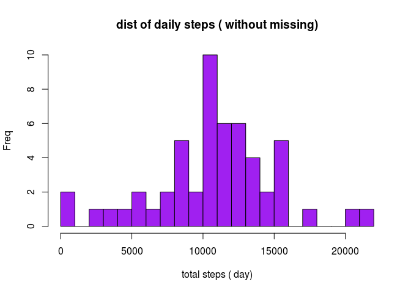
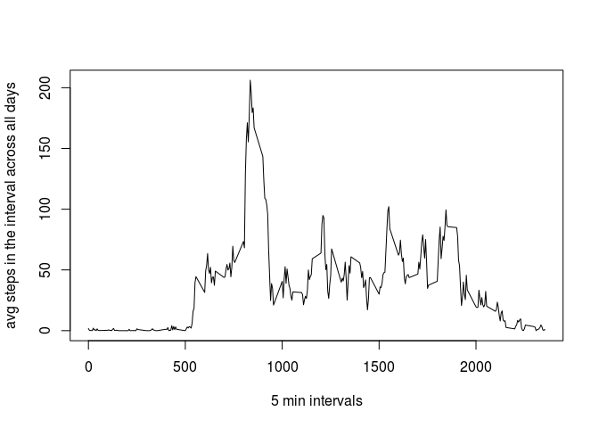
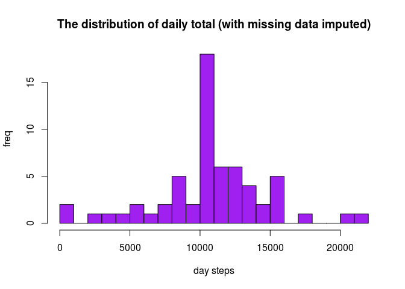
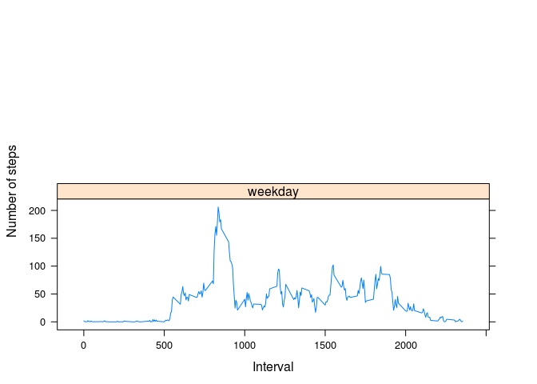

``` r
knitr::opts_chunk$set(echo = TRUE)
```

instructions (you can skip this part)
=====================================

Introduction
------------

It is now possible to collect a large amount of data about personal movement using activity monitoring devices such as a Fitbit, Nike Fuelband, or Jawbone Up. These type of devices are part of the "quantified self" movement -- a group of enthusiasts who take measurements about themselves regularly to improve their health, to find patterns in their behavior, or because they are tech geeks. But these data remain under-utilized both because the raw data are hard to obtain and there is a lack of statistical methods and software for processing and interpreting the data.

This assignment makes use of data from a personal activity monitoring device. This device collects data at 5 minute intervals through out the day. The data consists of two months of data from an anonymous individual collected during the months of October and November, 2012 and include the number of steps taken in 5 minute intervals each day.

Data
----

The data for this assignment can be downloaded from the course web site:

\*Dataset: Activity monitoring data <https://d396qusza40orc.cloudfront.net/repdata%2Fdata%2Factivity.zip>

The variables included in this dataset are:

\*steps: Number of steps taking in a 5-minute interval (missing values are coded as NA)

\*date: The date on which the measurement was taken in YYYY-MM-DD format

\*interval: Identifier for the 5-minute interval in which measurement was taken

The dataset is stored in a comma-separated-value (CSV) file and there are a total of 17,568 observations in this dataset.

Assignment
----------

This assignment will be described in multiple parts. You will need to write a report that answers the questions detailed below. Ultimately, you will need to complete the entire assignment in a single R markdown document that can be processed by knitr and be transformed into an HTML file.

Throughout your report make sure you always include the code that you used to generate the output you present. When writing code chunks in the R markdown document, always use echo = TRUE so that someone else will be able to read the code. This assignment will be evaluated via peer assessment so it is essential that your peer evaluators be able to review the code for your analysis.

For the plotting aspects of this assignment, feel free to use any plotting system in R (i.e., base, lattice, ggplot2)

Fork/clone the GitHub repository created for this assignment. You will submit this assignment by pushing your completed files into your forked repository on GitHub. The assignment submission will consist of the URL to your GitHub repository and the SHA-1 commit ID for your repository state.

NOTE: The GitHub repository also contains the dataset for the assignment so you do not have to download the data separately.

Loading and preprocessing the data
----------------------------------

Show any code that is needed to

1.Load the data (i.e. read.csv())

2.Process/transform the data (if necessary) into a format suitable for your analysis

What is mean total number of steps taken per day?
-------------------------------------------------

For this part of the assignment, you can ignore the missing values in the dataset.

1.Make a histogram of the total number of steps taken each day

2.Calculate and report the mean and median total number of steps taken per day

What is the average daily activity pattern?
-------------------------------------------

1.Make a time series plot (i.e. type = "l") of the 5-minute interval (x-axis) and the average number of steps taken, averaged across all days (y-axis)

2.Which 5-minute interval, on average across all the days in the dataset, contains the maximum number of steps?

Imputing missing values
-----------------------

Note that there are a number of days/intervals where there are missing values (coded as NA). The presence of missing days may introduce bias into some calculations or summaries of the data.

1.Calculate and report the total number of missing values in the dataset (i.e. the total number of rows with NAs)

2.Devise a strategy for filling in all of the missing values in the dataset. The strategy does not need to be sophisticated. For example, you could use the mean/median for that day, or the mean for that 5-minute interval, etc.

3.Create a new dataset that is equal to the original dataset but with the missing data filled in.

4.Make a histogram of the total number of steps taken each day and Calculate and report the mean and median total number of steps taken per day. Do these values differ from the estimates from the first part of the assignment? What is the impact of imputing missing data on the estimates of the total daily number of steps?

Are there differences in activity patterns between weekdays and weekends?
-------------------------------------------------------------------------

For this part the weekdays() function may be of some help here. Use the dataset with the filled-in missing values for this part.

1.Create a new factor variable in the dataset with two levels -- "weekday" and "weekend" indicating whether a given date is a weekday or weekend day.

2.Make a panel plot containing a time series plot (i.e. type = "l") of the 5-minute interval (x-axis) and the average number of steps taken, averaged across all weekday days or weekend days (y-axis). The plot should look something like the following, which was created using simulated data:

Your plot will look different from the one above because you will be using the activity monitor data. Note that the above plot was made using the lattice system but you can make the same version of the plot using any plotting system you choose.

Submitting the Assignment
-------------------------

To submit the assignment:

1.Commit your completed PA1\_template.Rmd file to the master branch of your git repository (you should already be on the master branch unless you created new ones)

2.Commit your PA1\_template.md and PA1\_template.html files produced by processing your R markdown file with the knit2html() function in R (from the knitr package)

3.If your document has figures included (it should) then they should have been placed in the figure/ directory by default (unless you overrode the default). Add and commit the figure/ directory to your git repository.

4.Push your master branch to GitHub.

5.Submit the URL to your GitHub repository for this assignment on the course web site.

In addition to submitting the URL for your GitHub repository, you will need to submit the 40 character SHA-1 hash (as string of numbers from 0-9 and letters from a-f) that identifies the repository commit that contains the version of the files you want to submit. You can do this in GitHub by doing the following:

1.Go into your GitHub repository web page for this assignment

2.Click on the "?? commits" link where ?? is the number of commits you have in the repository. For example, if you made a total of 10 commits to this repository, the link should say "10 commits".

3.You will see a list of commits that you have made to this repository. The most recent commit is at the very top. If this represents the version of the files you want to submit, then just click the "copy to clipboard" button on the right hand side that should appear when you hover over the SHA-1 hash. Paste this SHA-1 hash into the course web site when you submit your assignment. If you don't want to use the most recent commit, then go down and find the commit you want and copy the SHA-1 hash.

A valid submission will look something like (this is just an example!)

``` r
a<- "https://github.com/rdpeng/RepData_PeerAssessment1"
a
```

    ## [1] "https://github.com/rdpeng/RepData_PeerAssessment1"

``` r
b <-"7c376cc5447f11537f8740af8e07d6facc3d9645"
b
```

    ## [1] "7c376cc5447f11537f8740af8e07d6facc3d9645"

(Now begin my exercicse :) ) Loading and preprocessing the data
===============================================================

``` r
#first we will download the data
url <- "https://d396qusza40orc.cloudfront.net/repdata%2Fdata%2Factivity.zip"
download.file(url, destfile = "PA1.zip")
unzip("PA1.zip")

#now we have activity.csv. Lets see the content
activity <- read.csv("activity.csv",sep=",",  na.strings="NA")
head(activity)
```

    ##   steps       date interval
    ## 1    NA 2012-10-01        0
    ## 2    NA 2012-10-01        5
    ## 3    NA 2012-10-01       10
    ## 4    NA 2012-10-01       15
    ## 5    NA 2012-10-01       20
    ## 6    NA 2012-10-01       25

``` r
tail(activity)
```

    ##       steps       date interval
    ## 17563    NA 2012-11-30     2330
    ## 17564    NA 2012-11-30     2335
    ## 17565    NA 2012-11-30     2340
    ## 17566    NA 2012-11-30     2345
    ## 17567    NA 2012-11-30     2350
    ## 17568    NA 2012-11-30     2355

``` r
summary(activity)
```

    ##      steps                date          interval     
    ##  Min.   :  0.00   2012-10-01:  288   Min.   :   0.0  
    ##  1st Qu.:  0.00   2012-10-02:  288   1st Qu.: 588.8  
    ##  Median :  0.00   2012-10-03:  288   Median :1177.5  
    ##  Mean   : 37.38   2012-10-04:  288   Mean   :1177.5  
    ##  3rd Qu.: 12.00   2012-10-05:  288   3rd Qu.:1766.2  
    ##  Max.   :806.00   2012-10-06:  288   Max.   :2355.0  
    ##  NA's   :2304     (Other)   :15840

``` r
str(activity)
```

    ## 'data.frame':    17568 obs. of  3 variables:
    ##  $ steps   : int  NA NA NA NA NA NA NA NA NA NA ...
    ##  $ date    : Factor w/ 61 levels "2012-10-01","2012-10-02",..: 1 1 1 1 1 1 1 1 1 1 ...
    ##  $ interval: int  0 5 10 15 20 25 30 35 40 45 ...

``` r
# I prefer to use dataframes so...
 database <- data.frame()
 database <- rbind(database, activity)
 
 #now lets process the data : remove missing data and to date the dates
 database$date <- as.Date(database$date)
 database2 <- subset(database, !is.na(database$steps))
```

What is mean total number of steps taken per day?
-------------------------------------------------

``` r
daysum <- tapply(database2$steps, database2$date, sum, na.rm=TRUE, simplify=T)
daysum <- daysum[!is.na(daysum)]

hist(x=daysum,
     col="purple",
     breaks=25,
     xlab="total steps ( day)" ,
     ylab="Freq",
     main="dist of daily steps ( without missing)")
```



Now calculate the mean and median of steps/day

``` r
mean(daysum)
```

    ## [1] 10766.19

``` r
median(daysum)
```

    ## [1] 10765

What is the average daily activity pattern?
-------------------------------------------

I would create a time series plot of the 5 minutes interval (x) and the average number of steps(y)

``` r
database3 <- tapply(database2$steps, database2$interval, mean, na.rm=TRUE, simplify=T)
database4 <- data.frame(interval=as.integer(names(database3)), avg=database3)

with(database4,
     plot(interval,
          avg,
          type="l",
          xlab="5 min intervals",
          ylab="avg steps in the interval across all days"))
```



Which avg( 5 minutoes interval) contains the maximum number of steps?

``` r
max_steps <- max(database4$avg)
database4[database4$avg == max_steps, ]
```

    ##     interval      avg
    ## 835      835 206.1698

Imputing missing values
-----------------------

Now we need to calculate the total number of missing values in dataset

``` r
sum(is.na(database$steps))
```

    ## [1] 2304

our database started with 2304 nulls ( NA's).

we will include the mean in NA's

``` r
df_impute <- database
ndx <- is.na(df_impute$steps)
int_avg <- tapply(database2$steps, database2$interval, mean, na.rm=TRUE, simplify=T)
df_impute$steps[ndx] <- int_avg[as.character(df_impute$interval[ndx])]
```

now we will use the historgram of total steps /day and calculate the median total number of steps/day

``` r
new_dailysum <- tapply(df_impute$steps, df_impute$date, sum, na.rm=TRUE, simplify=T)

hist(x=new_dailysum,
     col="purple",
     breaks=25,
     xlab="day steps",
     ylab="freq",
     main="The distribution of daily total (with missing data imputed)")
```



``` r
mean(new_dailysum)
```

    ## [1] 10766.19

``` r
median(new_dailysum)
```

    ## [1] 10766.19

Are there differences in activity patterns between weekdays and weekends?
-------------------------------------------------------------------------

We need to create two factor variables. One for weekend and other for weekday or whathever the word for this in english.

``` r
is_weekday <- function(d) {
    wd <- weekdays(d)
    ifelse (wd == "saturday" | wd == "sunday"| wd =="sat" | wd =='sun', "weekend", "weekday")
}

wx<- sapply(df_impute$date, is_weekday)
df_impute$wk <- as.factor(wx)
head(df_impute)
```

    ##       steps       date interval      wk
    ## 1 1.7169811 2012-10-01        0 weekday
    ## 2 0.3396226 2012-10-01        5 weekday
    ## 3 0.1320755 2012-10-01       10 weekday
    ## 4 0.1509434 2012-10-01       15 weekday
    ## 5 0.0754717 2012-10-01       20 weekday
    ## 6 2.0943396 2012-10-01       25 weekday

``` r
wk_df <- aggregate(steps ~ wk+interval, data=df_impute, FUN=mean)

library(lattice)
xyplot(steps ~ interval | factor(wk),
       layout = c(1, 2),
       xlab="Interval",
       ylab="Number of steps",
       type="l",
       lty=1,
           data=wk_df)
```


