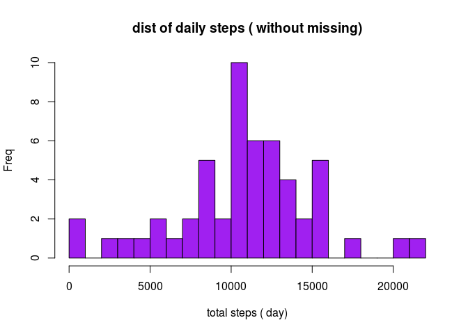
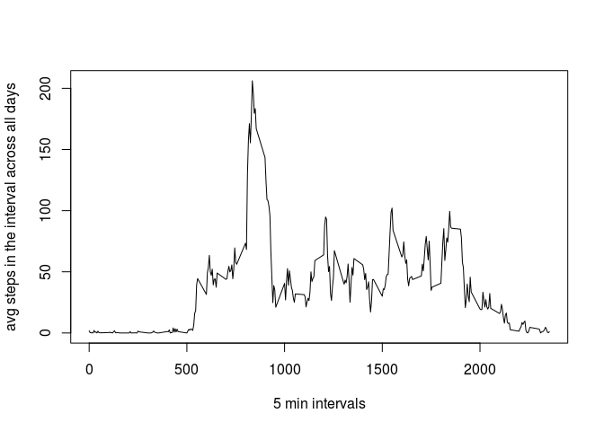
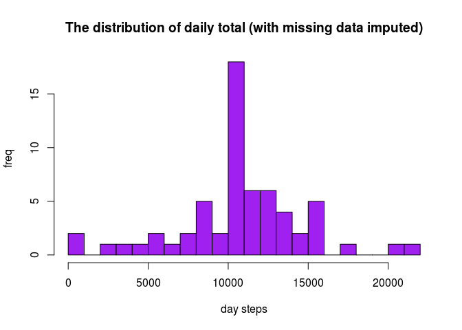
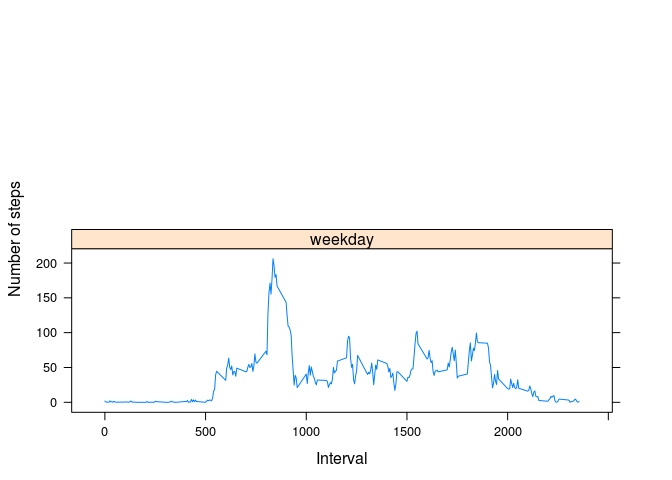

``` r
knitr::opts_chunk$set(echo = TRUE)
```

Loading and preprocessing the data
==================================

``` r
#first we will download the data
url <- "https://d396qusza40orc.cloudfront.net/repdata%2Fdata%2Factivity.zip"
download.file(url, destfile = "PA1.zip")
unzip("PA1.zip")

#now we have activity.csv. Lets see the content
activity <- read.csv("activity.csv",sep=",",  na.strings="NA")
head(activity)
```

    ##   steps       date interval
    ## 1    NA 2012-10-01        0
    ## 2    NA 2012-10-01        5
    ## 3    NA 2012-10-01       10
    ## 4    NA 2012-10-01       15
    ## 5    NA 2012-10-01       20
    ## 6    NA 2012-10-01       25

``` r
tail(activity)
```

    ##       steps       date interval
    ## 17563    NA 2012-11-30     2330
    ## 17564    NA 2012-11-30     2335
    ## 17565    NA 2012-11-30     2340
    ## 17566    NA 2012-11-30     2345
    ## 17567    NA 2012-11-30     2350
    ## 17568    NA 2012-11-30     2355

``` r
summary(activity)
```

    ##      steps                date          interval     
    ##  Min.   :  0.00   2012-10-01:  288   Min.   :   0.0  
    ##  1st Qu.:  0.00   2012-10-02:  288   1st Qu.: 588.8  
    ##  Median :  0.00   2012-10-03:  288   Median :1177.5  
    ##  Mean   : 37.38   2012-10-04:  288   Mean   :1177.5  
    ##  3rd Qu.: 12.00   2012-10-05:  288   3rd Qu.:1766.2  
    ##  Max.   :806.00   2012-10-06:  288   Max.   :2355.0  
    ##  NA's   :2304     (Other)   :15840

``` r
str(activity)
```

    ## 'data.frame':    17568 obs. of  3 variables:
    ##  $ steps   : int  NA NA NA NA NA NA NA NA NA NA ...
    ##  $ date    : Factor w/ 61 levels "2012-10-01","2012-10-02",..: 1 1 1 1 1 1 1 1 1 1 ...
    ##  $ interval: int  0 5 10 15 20 25 30 35 40 45 ...

``` r
# I prefer to use dataframes so...
 database <- data.frame()
 database <- rbind(database, activity)
 
 #now lets process the data : remove missing data and to date the dates
 database$date <- as.Date(database$date)
 database2 <- subset(database, !is.na(database$steps))
```

What is mean total number of steps taken per day?
-------------------------------------------------

``` r
daysum <- tapply(database2$steps, database2$date, sum, na.rm=TRUE, simplify=T)
daysum <- daysum[!is.na(daysum)]

hist(x=daysum,
     col="purple",
     breaks=25,
     xlab="total steps ( day)" ,
     ylab="Freq",
     main="dist of daily steps ( without missing)")
```



Now calculate the mean and median of steps/day

``` r
mean(daysum)
```

    ## [1] 10766.19

``` r
median(daysum)
```

    ## [1] 10765

What is the average daily activity pattern?
-------------------------------------------

I would create a time series plot of the 5 minutes interval (x) and the average number of steps(y)

``` r
database3 <- tapply(database2$steps, database2$interval, mean, na.rm=TRUE, simplify=T)
database4 <- data.frame(interval=as.integer(names(database3)), avg=database3)

with(database4,
     plot(interval,
          avg,
          type="l",
          xlab="5 min intervals",
          ylab="avg steps in the interval across all days"))
```



Which avg( 5 minutoes interval) contains the maximum number of steps?

``` r
max_steps <- max(database4$avg)
database4[database4$avg == max_steps, ]
```

    ##     interval      avg
    ## 835      835 206.1698

Imputing missing values
-----------------------

Now we need to calculate the total number of missing values in dataset

``` r
sum(is.na(database$steps))
```

    ## [1] 2304

our database started with 2304 nulls ( NA's).

we will include the mean in NA's

``` r
df_impute <- database
ndx <- is.na(df_impute$steps)
int_avg <- tapply(database2$steps, database2$interval, mean, na.rm=TRUE, simplify=T)
df_impute$steps[ndx] <- int_avg[as.character(df_impute$interval[ndx])]
```

now we will use the historgram of total steps /day and calculate the median total number of steps/day

``` r
new_dailysum <- tapply(df_impute$steps, df_impute$date, sum, na.rm=TRUE, simplify=T)

hist(x=new_dailysum,
     col="purple",
     breaks=25,
     xlab="day steps",
     ylab="freq",
     main="The distribution of daily total (with missing data imputed)")
```



``` r
mean(new_dailysum)
```

    ## [1] 10766.19

``` r
median(new_dailysum)
```

    ## [1] 10766.19

Are there differences in activity patterns between weekdays and weekends?
-------------------------------------------------------------------------

We need to create two factor variables. One for weekend and other for weekday or whathever the word for this in english.

``` r
is_weekday <- function(d) {
    wd <- weekdays(d)
    ifelse (wd == "saturday" | wd == "sunday"| wd =="sat" | wd =='sun', "weekend", "weekday")
}

wx<- sapply(df_impute$date, is_weekday)
df_impute$wk <- as.factor(wx)
head(df_impute)
```

    ##       steps       date interval      wk
    ## 1 1.7169811 2012-10-01        0 weekday
    ## 2 0.3396226 2012-10-01        5 weekday
    ## 3 0.1320755 2012-10-01       10 weekday
    ## 4 0.1509434 2012-10-01       15 weekday
    ## 5 0.0754717 2012-10-01       20 weekday
    ## 6 2.0943396 2012-10-01       25 weekday

``` r
wk_df <- aggregate(steps ~ wk+interval, data=df_impute, FUN=mean)

library(lattice)
xyplot(steps ~ interval | factor(wk),
       layout = c(1, 2),
       xlab="Interval",
       ylab="Number of steps",
       type="l",
       lty=1,
           data=wk_df)
```


